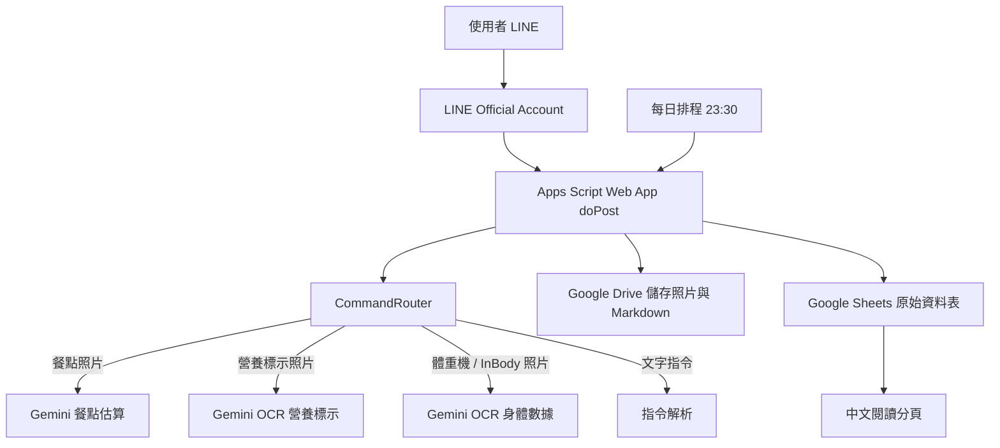

# 用 Codex 協作打造 LINE 飲食與身體紀錄 Bot

版本日期：2026-05-28  
目標讀者：想用 LINE、Google Apps Script、Google Sheets、Google Drive、Gemini API，自己部署一個個人飲食與身體紀錄 Bot 的使用者。  
核心前提：這不是單純手刻程式教學，而是「人類負責目標、帳號、權限、體驗判斷；Codex 負責規劃、寫程式、除錯、整理」的協作流程。

---

## 0. 這份教學要完成什麼

完成後，你會有一個獨立 LINE Bot，可以做到：

- 傳餐點照片，自動估算熱量、蛋白質、碳水、脂肪。
- 傳營養標示照片，自動讀取營養標示並記錄。
- 傳體重機或 InBody 照片，自動讀取身體數據。
- 用文字輸入身體數據，例如：`體重 72.5 體脂 18.3 骨骼肌 32.1`。
- 查詢今日飲食進度：`今日`。
- 修正上一筆餐點熱量：`改成 850`。
- 取消上一筆餐點：`不記錄`。
- 產生每日 Markdown 記憶：`今日總結`。
- 每天晚上自動產生 Markdown 記憶到 Google Drive。
- 在 Google Sheets 看到原始資料與中文閱讀分頁。
- 在 ApiUsage 分頁了解 Gemini API 使用量與估計成本。

---

## 1. 系統架構



主要元件：

- LINE Messaging API：接收使用者訊息。
- Google Apps Script：Webhook、邏輯處理、呼叫 Gemini、讀寫 Sheets/Drive。
- Google Sheets：MVP 資料庫。
- Google Drive：存餐點照片、營養標示照片、身體數據照片、每日 Markdown。
- Gemini API：圖片分類、餐點估算、營養標示 OCR、身體數據 OCR、每日記憶。
- Codex：協助規劃、寫程式、檢查錯誤、重構 UX、產生教學文件。

---

## 2. 人和 Codex 的分工

### 你需要自己處理

- 建立 LINE Official Account。
- 建立 LINE Messaging API Channel。
- 取得 LINE Channel Secret。
- 取得 LINE Channel Access Token。
- 建立 Google Sheet。
- 建立 Google Drive 資料夾。
- 取得 Gemini API Key。
- 在 Apps Script 設定 Script Properties。
- 將 Apps Script Web App URL 貼到 LINE Developers。
- 遇到權限授權畫面時手動授權。
- 判斷 Bot 回覆是否符合你的使用習慣。

### Codex 可以幫你處理

- 將專案目標拆成可執行流程。
- 設計 Google Sheets schema。
- 撰寫 Apps Script 程式碼。
- 實作 LINE webhook。
- 實作圖片下載、Drive 上傳、Sheets 寫入。
- 實作 Gemini prompt 與 JSON parsing。
- 實作 UX 回覆文字。
- 實作 FoodRules、營養標示、身體數據、中文分頁。
- 根據錯誤截圖判斷可能原因。
- 產生部署清單與教學文件。

---

## 3. 專案目標定義

建議先把目標寫清楚，再讓 Codex 幫你規劃。

範例目標：

```text
我要做一個個人用 LINE Bot，幫我記錄飲食與身體數據。

V0.1 需求：
- 傳餐點照片，AI 估算熱量與三大營養素。
- 傳營養標示照片，AI 讀取營養標示並記錄。
- 傳體重機或 InBody 照片，AI 讀取身體數據。
- 輸入「今日」查看今日累計。
- 輸入「改成 850」修正上一筆餐點熱量。
- 輸入「不記錄」取消上一筆餐點。
- 每天晚上產生 Markdown 記憶到 Google Drive。
- Google Sheets 作為資料庫，並建立中文閱讀分頁。

限制：
- 不接 Notion。
- 不使用 PostgreSQL 或 Supabase。
- 使用 Google Apps Script 部署。
- 使用 Gemini Flash-Lite 系列模型。
- 先做個人使用，不處理多人商業場景。
```

可貼給 Codex：

```text
請根據上面的目標，幫我拆解系統架構、使用者流程、資料表設計、部署步驟、風險與需要我手動處理的事項。先不要寫程式。
```

---

## 4. 建立 LINE Bot

### 4.1 建立 LINE Official Account

1. 到 LINE Official Account Manager。
2. 建立新的官方帳號。
3. 建議名稱明確，例如：`個人熱量助手`。
4. 加自己為好友，確認帳號存在。

### 4.2 建立 Messaging API Channel

1. 到 LINE Developers Console。
2. 建立或選擇 Provider。
3. 建立 Messaging API Channel。
4. 將剛剛建立的官方帳號綁定到 Channel。

### 4.3 需要保存的 LINE 資訊

你會需要：

- `LINE_CHANNEL_SECRET`
- `LINE_CHANNEL_ACCESS_TOKEN`

注意：

- 不要把 token 貼到公開文件。
- 不要把 token commit 到 GitHub。
- 在 Apps Script 內用 Script Properties 保存。

### 4.4 LINE 後台建議設定

在 LINE Official Account Manager：

- 關閉或調整自動回應，避免和 webhook 回覆衝突。
- 開啟 Webhook。
- 若使用 Messaging API 回覆，確認聊天相關設定不會攔截 webhook。

---

## 5. 建立 Google Sheets 資料庫

建立一個 Google Sheet，例如：

```text
LINE BOT 熱量追蹤資料庫
```

取得 Sheet ID：

```text
https://docs.google.com/spreadsheets/d/{SHEET_ID}/edit
```

你要保存：

```text
SHEET_ID
```

### 5.1 原始資料表

Apps Script 會建立或使用這些分頁：

- `MealLogs`：餐點與營養標示紀錄。
- `BodyMetrics`：體重機 / InBody / 身體數據紀錄。
- `FoodRules`：台灣常見食物估算規則。
- `UserProfile`：個人目標，例如熱量與蛋白質目標。
- `SystemEvents`：系統事件與錯誤。
- `ApiUsage`：Gemini API 使用紀錄。
- `MemoryIndex`：每日 Markdown 記憶索引。
- `DailySummary`：每日飲食彙總。
- `WebhookDebug`：Webhook debug 用資料。

### 5.2 中文閱讀分頁

不要直接把原始表頭改成中文。建議保留英文欄位給程式使用，另外建立中文閱讀層：

- `欄位說明`
- `飲食紀錄_中文`
- `身體紀錄_中文`
- `API使用紀錄_中文`
- `每日總結_中文`

原因：

- 程式讀寫依賴英文欄位。
- 英文 JSON key 對 Gemini 與 Apps Script 比較穩。
- 中文表作為閱讀層，風險低，也比較好維護。

---

## 6. 建立 Google Drive 資料夾

建立一個主資料夾，例如：

```text
LINE CalorieBot
```

取得資料夾 ID：

```text
https://drive.google.com/drive/folders/{DRIVE_ROOT_FOLDER_ID}
```

你要保存：

```text
DRIVE_ROOT_FOLDER_ID
```

Bot 會自動建立子資料夾：

```text
images/food_photos/YYYY/MM
images/nutrition_labels/YYYY/MM
images/body_metrics/YYYY/MM
memory_md/daily
```

---

## 7. 取得 Gemini API Key

到 Google AI Studio 或 Google Cloud 取得 Gemini API key。

你要保存：

```text
GEMINI_API_KEY
```

模型名稱依當下 Google 可用模型為準。此專案範例使用：

```text
gemini-3.1-flash-lite
```

如果部署時模型不可用，請讓 Codex 協助你查目前可用的 Gemini Flash-Lite 或 Flash 模型，並更新 Script Properties 的 `GEMINI_MODEL`。

---

## 8. 建立 Apps Script 專案

1. 到 Google Apps Script。
2. 建立新專案。
3. 命名，例如：`LINE BOT 熱量追蹤 Apps Script`。
4. 建立下列 `.gs` 檔案。

建議檔案：

```text
Code.gs
Config.gs
Utils.gs
SheetService.gs
LineService.gs
DriveService.gs
GeminiService.gs
MemoryService.gs
CommandRouter.gs
FoodRulesSeed.gs
ChineseViewService.gs
```

### 8.1 每個檔案負責什麼

`Code.gs`

- `doPost(e)`
- `doGet()`
- `setupSheets()`
- webhook 入口。

`Config.gs`

- 從 Script Properties 讀取設定。
- 例如 LINE token、Gemini key、Sheet ID、Drive folder ID。

`Utils.gs`

- 日期、時間、JSON parsing、檔名清理、數字轉換等工具函式。

`SheetService.gs`

- Google Sheets schema。
- 讀寫 `MealLogs`、`BodyMetrics`、`ApiUsage` 等資料。

`LineService.gs`

- LINE 回覆訊息。
- LINE 圖片下載。

`DriveService.gs`

- 儲存餐點照片、營養標示照片、身體數據照片。
- 儲存每日 Markdown。

`GeminiService.gs`

- 呼叫 Gemini。
- 圖片分類。
- 餐點估算。
- 營養標示 OCR。
- 身體數據 OCR。
- 每日記憶生成。

`MemoryService.gs`

- 手動或排程產生每日記憶。
- 設定每天 23:30 自動觸發。

`CommandRouter.gs`

- 判斷 LINE 訊息類型。
- 處理圖片、文字指令、回覆 UX。

`FoodRulesSeed.gs`

- 台灣常見外食與食物粗估規則。

`ChineseViewService.gs`

- 建立中文閱讀分頁。
- 建立 API 使用紀錄中文表。

---

## 9. Script Properties 設定

在 Apps Script：

1. 左側設定齒輪。
2. Script Properties。
3. 新增下列屬性。

```text
LINE_CHANNEL_SECRET=你的 LINE Channel Secret
LINE_CHANNEL_ACCESS_TOKEN=你的 LINE Channel Access Token
GEMINI_API_KEY=你的 Gemini API Key
GEMINI_MODEL=gemini-3.1-flash-lite
SHEET_ID=你的 Google Sheet ID
DRIVE_ROOT_FOLDER_ID=你的 Google Drive 資料夾 ID
TIMEZONE=Asia/Taipei
DEFAULT_TARGET_CALORIES=2100
DEFAULT_PROTEIN_TARGET_G=130
```

注意：

- 不要把這些值寫死在程式碼。
- 不要把密鑰貼給不可信任的人。
- 截圖分享時請遮住 token。

---

## 10. 部署 Apps Script Web App

1. Apps Script 右上角點「部署」。
2. 選「新增部署作業」。
3. 類型選「網頁應用程式」。
4. 執行身分：我。
5. 誰可以存取：所有人。
6. 部署。
7. 第一次部署會要求授權，照流程授權。
8. 複製 Web App URL，通常結尾是 `/exec`。

把 Web App URL 貼到 LINE Developers 的 Webhook URL。

---

## 11. 初始化

Apps Script 貼完程式碼後，先執行：

```javascript
setupSheets()
```

作用：

- 建立必要分頁。
- 寫入英文欄位。
- 初始化 FoodRules。

接著執行：

```javascript
setupChineseViews()
```

作用：

- 建立中文閱讀分頁。
- 建立 `API使用紀錄_中文`。

如果要每天晚上自動產生記憶，執行：

```javascript
setupDailyMemoryTrigger()
```

作用：

- 建立每天 23:30 的 Apps Script trigger。
- 每天自動呼叫 `scheduledDailyMemoryJob()`。

---

## 12. LINE Webhook 設定

在 LINE Developers：

1. 找到 Messaging API Channel。
2. Webhook URL 填 Apps Script Web App `/exec` URL。
3. 開啟 Use webhook。
4. 儲存。

### 關於 Verify 失敗

Google Apps Script Web App 有時候在 LINE Verify 時會出現：

```text
302 Found
```

或：

```text
405 Method Not Allowed
```

處理方式：

- 確認你貼的是 `/exec` URL，不是瀏覽器轉址後的 `script.googleusercontent.com` URL。
- 確認 Web App 存取權是「所有人」。
- 確認不是貼 `/dev` URL。
- 確認 `doPost(e)` 存在且儲存成功。
- 即使 Verify 失敗，也可以直接傳 LINE 訊息測試。
- 到 Apps Script 的「執行項目」看是否有 `doPost` 執行。

實務上，只要 LINE 訊息能觸發 `doPost` 並收到 Bot 回覆，就代表 webhook 已可用。

---

## 13. 使用者流程

### 13.1 傳餐點照片

使用者傳一般餐點照片。

Bot 會：

1. 判斷圖片是餐點照片。
2. 存照片到 Drive。
3. 呼叫 Gemini 估算餐名、熱量、蛋白質、碳水、脂肪。
4. 套用 FoodRules。
5. 寫入 `MealLogs`。
6. 回覆今日進度。

回覆範例：

```text
已記錄：蒸餃
約 550 kcal｜P 25g｜C 60g｜F 22g
信心：中

今日：950 / 2100 kcal
蛋白質：45 / 130 g

可回覆：改成 600、不記錄、今日
```

### 13.2 傳營養標示照片

使用者拍超商食品或包裝食品營養標示。

Bot 會：

1. 判斷圖片是營養標示。
2. 存照片到 Drive。
3. 呼叫 Gemini OCR 讀取營養標示。
4. 優先記錄每包裝，其次每份，最後每 100g。
5. 寫入 `MealLogs`。
6. 回覆今日進度。

回覆範例：

```text
已記錄：雞胸肉飯糰
來源：營養標示（每包裝）
320 kcal｜P 18g｜C 42g｜F 8g
份量：1 包

今日：1270 / 2100 kcal
蛋白質：63 / 130 g

可回覆：改成 600、不記錄、今日
```

### 13.3 傳體重機或 InBody 照片

使用者拍體重機、體脂計、InBody 報告。

Bot 會：

1. 判斷圖片是身體數據。
2. 存照片到 Drive。
3. 呼叫 Gemini OCR 讀取身體數據。
4. 寫入 `BodyMetrics`。
5. 和上一筆身體數據做簡單比較。

回覆範例：

```text
已記錄身體數據
體重：72.5 kg
體脂：18.3 %
骨骼肌：32.1 kg
基礎代謝：1680 kcal

與上一筆相比：
體重：-0.3 kg
體脂：-0.2 %
骨骼肌：+0.1 kg

可回覆：今日總結，或繼續傳體重機 / InBody 照片
```

### 13.4 文字輸入身體數據

可以直接輸入：

```text
體重 72.5 體脂 18.3 骨骼肌 32.1
```

Bot 會寫入 `BodyMetrics`。

### 13.5 查今日

輸入：

```text
今日
```

回覆範例：

```text
今日進度

熱量：1270 / 2100 kcal
剩餘：約 830 kcal

蛋白質：63 / 130 g
還差：約 67 g

已記錄：3 餐
```

### 13.6 修正上一筆餐點

輸入：

```text
改成 850
```

Bot 會修正同一使用者最近一筆 active 餐點的熱量。

### 13.7 取消上一筆餐點

輸入：

```text
不記錄
```

Bot 會把同一使用者最近一筆 active 餐點標記為 `cancelled`。

### 13.8 今日總結

輸入：

```text
今日總結
```

Bot 會產生 Markdown 到 Drive，並寫入 `MemoryIndex`。

每日 23:30 也可以自動產生。

---

## 14. Google Sheets 中文閱讀層

### 14.1 欄位說明

`欄位說明` 會解釋英文欄位含義。

例如：

| 資料表 | 英文欄位 | 中文名稱 | 說明 |
|---|---|---|---|
| MealLogs | ai_calories | AI 熱量 | AI 或營養標示讀出的熱量 |
| BodyMetrics | body_fat_percent | 體脂率 | 百分比 |
| ApiUsage | task_type | 任務類型 | Gemini 呼叫用途 |

### 14.2 API使用紀錄_中文

此分頁用來看 Gemini API 呼叫狀況。

會顯示：

- 時間
- 模型
- 任務類型
- 任務說明
- 輸入 token
- 輸出 token
- 總 token
- 估計成本 USD
- 估計成本 TWD
- LINE 訊息 ID
- 是否成功
- 錯誤訊息

任務對照：

| task_type | 中文說明 |
|---|---|
| estimate_meal | 餐點照片估算 |
| classify_food_image | 圖片類型判斷 |
| parse_nutrition_label | 營養標示讀取 |
| parse_body_metric | 身體數據讀取 |
| daily_memory | 每日記憶生成 |

注意：

- 成本是估計值，只供觀察趨勢。
- 台幣換算暫用 `1 USD = 32 TWD`。
- 實際費率請以 Google 官方帳單為準。

---

## 15. FoodRules 的角色

Gemini 看照片本質上是估算，不是營養資料庫。

FoodRules 的目的：

- 補足台灣常見外食。
- 讓蒸餃、水餃、便當、早餐店、夜市小吃等常見食物有比較穩定的基準。
- 避免模型回傳明顯不合理的 0 kcal。

FoodRules 不是精準營養資料庫，而是「粗估基準」。

建議後續做法：

- 先用預設 FoodRules。
- 真正常吃的食物再慢慢修。
- 如果某家店有官方營養標示，優先拍營養標示。
- 如果常吃固定品項，可以加自己的規則。

---

## 16. 除錯流程

### 16.1 先看 Apps Script 是否有語法錯

如果 Apps Script 顯示：

```text
SyntaxError
```

常見原因：

- 貼錯檔案。
- 少貼一段。
- 中文引號或特殊符號貼壞。
- 括號沒有結束。

做法：

1. 看錯誤行數。
2. 將該檔案重新從本機完整貼上。
3. 儲存。
4. 再執行。

### 16.2 `getConfig is not defined`

代表 `Config.gs` 沒有正確載入。

處理：

- 確認 Apps Script 左側有 `Config.gs`。
- 確認裡面有：

```javascript
function getConfig() {
```

- 確認已儲存。
- 如果不確定，重新貼上 `Config.gs`。

### 16.3 `function not defined`

代表缺少某個 `.gs` 檔，或貼錯檔案。

處理：

- 確認所有檔案都存在。
- 確認檔名不重要，但函式內容要完整。
- 重新貼上相關 service 檔。

### 16.4 LINE 沒回應

檢查順序：

1. LINE Webhook 是否開啟。
2. Webhook URL 是否為 Apps Script `/exec`。
3. Apps Script Web App 是否設定「所有人可存取」。
4. 是否部署了新版本。
5. Apps Script 執行項目是否有 `doPost`。
6. `SystemEvents` 是否有錯誤。
7. `ApiUsage` 是否有 Gemini 錯誤。

### 16.5 Google Sheets 沒資料

檢查：

- `SHEET_ID` 是否正確。
- `setupSheets()` 是否執行成功。
- Apps Script 是否有 Sheet 權限。
- 是否寫到另一份 Sheet。
- `SystemEvents` 是否有錯誤。

### 16.6 Gemini 失敗

檢查：

- `GEMINI_API_KEY` 是否正確。
- `GEMINI_MODEL` 是否可用。
- API 是否有額度。
- `ApiUsage` 的 `error` 欄。

---

## 17. 用 Codex 除錯的方式

遇到錯誤時，不要只說「壞了」。最好給 Codex：

- 錯誤截圖。
- 錯誤文字。
- 你剛剛做了什麼。
- 哪個檔案剛改過。
- 是否有重新部署。
- Apps Script 執行項目是否有紀錄。
- Google Sheets 有沒有新資料。

可貼給 Codex：

```text
我剛剛貼完 Apps Script 並執行 setupSheets()，出現這個錯誤：

錯誤內容：
ReferenceError: getConfig is not defined
setupSheets @ Code.gs:88

我目前 Apps Script 左側有這些檔案：
...

請幫我判斷最可能原因，並告訴我下一步只需要做什麼。
```

---

## 18. 新增功能的協作流程

本專案後來新增了幾個功能：

- FoodRules。
- 營養標示照片。
- 體重機 / InBody 照片。
- 身體數據文字輸入。
- 中文閱讀分頁。
- API 使用紀錄中文表。

推薦新增功能流程：

1. 先用自然語言描述需求。
2. 請 Codex 先分析 UX，不要馬上寫程式。
3. 確定使用者如何操作。
4. 確定資料要寫到哪張表。
5. 確定回覆文字。
6. 再請 Codex 修改 Apps Script。
7. 貼上、儲存、執行初始化或部署。
8. 用真實 LINE 訊息測試。
9. 再回頭檢討 UX。

範例 prompt：

```text
我想新增一個輸入方式：使用者拍營養標示表。
Bot 需要判斷這是營養標示，不要用餐點照片估算，而是直接 OCR 讀取每包裝、每份或每 100g 的熱量與三大營養素。
先不要寫程式，請先幫我設計使用者流程、資料寫入方式、可能錯誤與 UX 回覆。
```

---

## 19. UX 檢討原則

這種個人工具不需要過度設計。

建議原則：

- LINE 回覆要短。
- 每次回覆只給下一步最可能需要的指令。
- 不要在 LINE 裡塞太多分析。
- 真正分析放到每日 Markdown。
- Google Sheets 原始表保留完整資料。
- 中文閱讀表讓人看懂即可。

本專案目前的 UX 主線：

- 快速記錄：拍照或文字。
- 快速修正：`改成 850`。
- 快速取消：`不記錄`。
- 快速查詢：`今日`。
- 長期分析：`今日總結` 與每日自動記憶。

---

## 20. 維護方式

日常維護：

- 看 `API使用紀錄_中文` 了解成本。
- 看 `SystemEvents` 排查錯誤。
- 看 `飲食紀錄_中文` 檢查 AI 估算是否合理。
- 看 `身體紀錄_中文` 檢查 OCR 是否穩。
- 每幾天看一次 Drive 的 Markdown 記憶。

新增資料：

- 常吃食物可加到 `FoodRules`。
- 個人目標可改 `UserProfile` 或 Script Properties。
- 模型名稱可改 `GEMINI_MODEL`。

部署新版本：

1. 修改 Apps Script。
2. 儲存。
3. 若改了 schema，執行 `setupSheets()`。
4. 若改了中文表，執行 `setupChineseViews()`。
5. 部署新版本。
6. 用 LINE 實測。

---

## 21. 建議的 Codex prompt 範本

### 21.1 規劃

```text
我想做一個 LINE Bot，目標是：
...

請你先不要寫程式，先幫我整理：
1. 使用者流程
2. 系統流程
3. 資料表設計
4. 需要我手動申請或設定的項目
5. 你可以幫我處理的項目
6. MVP 範圍
```

### 21.2 實作

```text
請根據這份流程實作 Apps Script 版本。
限制：
- 不使用 Vercel。
- Google Sheets 作為資料庫。
- Google Drive 存圖片與 Markdown。
- Gemini 做圖片分析。
- 程式拆成多個 .gs 檔案。
- 請提供每個檔案要貼到 Apps Script 的完整內容。
```

### 21.3 除錯

```text
我在 Apps Script 遇到錯誤：

錯誤訊息：
...

我剛剛做的事：
...

目前現象：
...

請用最小步驟幫我定位問題，不要一次叫我改很多東西。
```

### 21.4 UX 檢討

```text
請不要看程式碼，單純從使用者體驗檢討目前 LINE Bot 的輸入與回覆。
列出：
1. 使用者能做什麼
2. 每種輸入會收到什麼回覆
3. 哪些地方可能混淆
4. 建議修改版本
```

### 21.5 新增功能

```text
我想新增功能：
...

請先分析：
1. 這個功能是否適合放進現有 Bot
2. 使用者怎麼操作最自然
3. 要新增或修改哪些資料表
4. 需要改哪些 Apps Script 檔案
5. 可能的錯誤與測試方式

先不要寫程式。
```

---

## 22. 最小部署 checklist

### 帳號與金鑰

- [ ] LINE Official Account 已建立。
- [ ] Messaging API Channel 已建立。
- [ ] `LINE_CHANNEL_SECRET` 已取得。
- [ ] `LINE_CHANNEL_ACCESS_TOKEN` 已取得。
- [ ] Google Sheet 已建立。
- [ ] `SHEET_ID` 已取得。
- [ ] Google Drive 主資料夾已建立。
- [ ] `DRIVE_ROOT_FOLDER_ID` 已取得。
- [ ] Gemini API Key 已取得。

### Apps Script

- [ ] 所有 `.gs` 檔案已貼上。
- [ ] Script Properties 已設定。
- [ ] `setupSheets()` 執行成功。
- [ ] `setupChineseViews()` 執行成功。
- [ ] `setupDailyMemoryTrigger()` 執行成功。
- [ ] Web App 已部署。
- [ ] Web App URL 已貼到 LINE Developers。

### 測試

- [ ] 傳 `今日` 有回應。
- [ ] 傳餐點照片有回應。
- [ ] `MealLogs` 有新增資料。
- [ ] 傳營養標示照片有回應。
- [ ] 傳體重機 / InBody 照片有回應。
- [ ] `BodyMetrics` 有新增資料。
- [ ] `ApiUsage` 有新增資料。
- [ ] 中文分頁能讀到資料。
- [ ] `今日總結` 能產生 Markdown。

---

## 23. 最後建議

這類個人 AI 工具最重要的不是第一天就做到完美，而是先讓資料流穩定：

1. LINE 能收到輸入。
2. Apps Script 能處理。
3. Sheets 能記錄。
4. Drive 能保存。
5. Gemini 能回傳可解析 JSON。
6. 使用者能看懂資料。

等使用 2 到 3 天後，再根據真實痛點迭代：

- 哪些食物常估錯。
- 哪些營養標示 OCR 常讀錯。
- 哪些身體數據欄位最重要。
- 中文分頁是否好讀。
- API 成本是否合理。
- 每日記憶是否真的有幫助。

這也是使用 Codex 協作的核心：先讓系統跑起來，再用真實使用經驗帶著 Codex 一步一步改。
