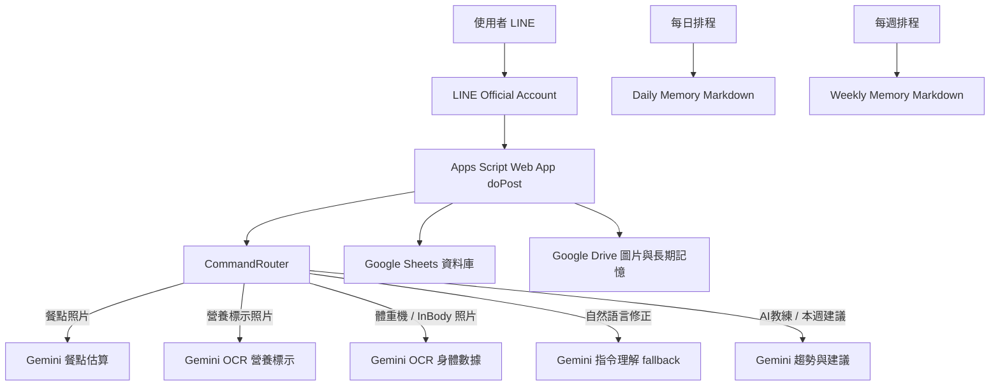

# 用 Codex 協作部署 LINE 熱量追蹤 Bot

版本日期：2026-06-02  
適合對象：想自己部署一個個人用 LINE 飲食、熱量、身體紀錄 Bot，並希望用 Codex 協助規劃、寫程式、除錯與改善 UX 的使用者。  
核心前提：你不需要一次懂完所有程式，但你需要負責帳號、權限、部署、測試與體驗判斷；Codex 負責把需求拆成可執行步驟、產生 Apps Script、分析錯誤與協助迭代。

---

## 0. 完成後會得到什麼

你會得到一個獨立 LINE Bot，可以用 Rich Menu 和自然語言完成下列工作：

```text
今日｜記體重｜記飲食
本週總結｜API額度｜AI教練
```

主要功能：

- 傳餐點照片，估算熱量、蛋白質、碳水、脂肪。
- 傳營養標示照片，直接讀取營養標示並記錄。
- 傳體重機 / InBody 照片，讀取身體數據。
- 文字輸入身體數據，例如 `體重 75.3 體脂 18.3 骨骼肌 32.1`。
- 用 `今日` 查看今日累計。
- 用 `本週總結` 查看即時週趨勢 Flex 卡片，不存檔。
- 用 `AI教練` 取得今日飲食建議。
- 用自然語言修正上一筆餐點，例如：

```text
改700
改700 P30
這餐應該 700 左右，蛋白質大概 30
碳水抓 60，脂肪不要動
```

- 用 `不記錄` 刪除上一筆餐點。
- 用 `復原` 或 `undo` 復原上一個修正或刪除。
- 每日 / 每週自動產生長期 Markdown 記憶。
- 在 Google Sheets 查看原始資料與中文閱讀分頁。
- 在 `ApiUsage` 查看 Gemini API 使用量與估算成本。

---

## 1. 系統架構



核心元件：

- LINE Messaging API：接收文字、圖片與 Rich Menu 點擊。
- Google Apps Script：Webhook、指令解析、資料寫入、Gemini 呼叫。
- Google Sheets：MVP 資料庫。
- Google Drive：保存圖片與自動記憶 Markdown。
- Gemini API：圖片判讀、OCR、飲食估算、自然語言修正解析、趨勢建議。
- Codex：協助規劃、寫 Apps Script、除錯、重構 UX、產生文件、更新 GitHub。

---

## 2. 人與 Codex 的分工

### 你需要處理

- 建立 LINE Official Account。
- 建立 LINE Messaging API Channel。
- 取得 `LINE_CHANNEL_SECRET`。
- 取得 `LINE_CHANNEL_ACCESS_TOKEN`。
- 建立 Google Sheet。
- 建立 Google Drive 主資料夾。
- 取得 Gemini API key。
- 上傳 Rich Menu 圖片到 Google Drive。
- 在 Apps Script 設定 Script Properties。
- 將 Web App URL 貼到 LINE Developers webhook。
- 看到 Google 授權畫面時手動授權。
- 實際傳訊息、傳照片、判斷 UX 是否好用。

### Codex 可以處理

- 幫你釐清目標與使用者流程。
- 設計 Google Sheets schema。
- 產生 Apps Script 程式碼。
- 實作 LINE webhook、Drive、Sheets、Gemini 整合。
- 產生 Rich Menu 圖片與 setup 程式。
- 根據錯誤截圖判斷問題。
- 幫你更新 README、部署教學與 GitHub。
- 根據真實使用回饋調整 UX。

---

## 3. 開始前先定義目標

建議先把目標講清楚，不要一開始就要求 Codex 寫程式。

可貼給 Codex：

```text
我要做一個個人用 LINE Bot，幫我記錄飲食、熱量與身體數據。

需求：
- 傳餐點照片，AI 估算熱量與三大營養素。
- 傳營養標示照片，AI 直接讀表格並記錄。
- 傳體重機 / InBody 照片，AI 讀取身體數據。
- 使用 Google Sheets 作為資料庫。
- 使用 Google Drive 保存圖片與長期記憶。
- 使用 Google Apps Script 部署。
- 使用 Gemini Flash-Lite 系列模型。
- 用 Rich Menu 提供主要入口。
- 本週總結要即時回 LINE 卡片，不要存檔。
- 每日 / 每週自動記憶才需要存成 Markdown。

請先幫我拆使用者流程、系統流程、資料表、部署步驟與風險，不要急著寫程式。
```

---

## 4. 建立 LINE Bot

### 4.1 建立 LINE Official Account

1. 到 LINE Official Account Manager。
2. 建立新的官方帳號。
3. 名稱可用類似：

```text
個人熱量助手
```

4. 關閉不需要的自動聊天功能，避免官方預設訊息干擾。

### 4.2 建立 Messaging API Channel

1. 到 LINE Developers Console。
2. 建立或選擇 Provider。
3. 建立 Messaging API Channel。
4. 取得：

```text
LINE_CHANNEL_SECRET
LINE_CHANNEL_ACCESS_TOKEN
```

5. 先不要急著 Verify webhook，等 Apps Script Web App 部署完成再設定。

---

## 5. 建立 Google 資源

### 5.1 Google Sheet

建立一份 Google Sheet，名稱可用：

```text
LINE BOT 熱量追蹤資料庫
```

取得 Sheet ID：

```text
https://docs.google.com/spreadsheets/d/{SHEET_ID}/edit
```

### 5.2 Google Drive 資料夾

建立主資料夾，例如：

```text
CalorieBot
```

取得資料夾 ID：

```text
https://drive.google.com/drive/folders/{DRIVE_ROOT_FOLDER_ID}
```

### 5.3 Gemini API key

到 Google AI Studio 或你使用的 Google Cloud / Gemini API 管理介面取得 API key。

Script Property 會用：

```text
GEMINI_API_KEY
GEMINI_MODEL=gemini-3.1-flash-lite
```

如果模型名稱日後改版，請以你帳號可呼叫的 Gemini 模型為準。

---

## 6. 建立 Apps Script 專案

1. 到 [Google Apps Script](https://script.google.com/)。
2. 建立新專案。
3. 依照 repo `apps-script/` 內檔名建立 `.gs` 檔。
4. 將每個檔案內容貼上。

需要貼的檔案包含：

```text
Code.gs
Config.gs
Utils.gs
CommandRouter.gs
LineService.gs
GeminiService.gs
SheetService.gs
DriveService.gs
MemoryService.gs
FlexMessageService.gs
RichMenuService.gs
FoodRulesSeed.gs
NutritionGuardrails.gs
ChineseViewService.gs
```

注意：

- Apps Script 沒有自動同步 GitHub，更新程式時仍需要手動貼檔或使用 clasp。
- 每次貼完修改都要儲存。
- Web App 修改後要重新部署「新增版本」，LINE 才會用到新程式。

---

## 7. 設定 Script Properties

到 Apps Script 左側齒輪「專案設定」新增 Script Properties。

範例：

```text
LINE_CHANNEL_SECRET=你的 LINE Channel Secret
LINE_CHANNEL_ACCESS_TOKEN=你的 LINE Channel Access Token
GEMINI_API_KEY=你的 Gemini API key
GEMINI_MODEL=gemini-3.1-flash-lite
SHEET_ID=你的 Google Sheet ID
DRIVE_ROOT_FOLDER_ID=你的 Google Drive 資料夾 ID
RICH_MENU_IMAGE_FILE_ID=你的 Rich Menu 圖片 Drive file ID
TIMEZONE=Asia/Taipei
DEFAULT_TARGET_CALORIES=2100
DEFAULT_PROTEIN_TARGET_G=130
```

不要把真實值貼到 GitHub、README、截圖或聊天訊息。

---

## 8. 初始化資料表與排程

在 Apps Script 上方選擇函式並執行：

```text
setupSheets()
```

用途：

- 建立資料表。
- 建立欄位。
- 補 FoodRules 預設資料。

接著執行：

```text
setupChineseViews()
```

用途：

- 建立中文閱讀分頁。
- 讓你不用只看英文欄位。

接著設定自動記憶排程：

```text
setupDailyMemoryTrigger()
setupWeeklyMemoryTrigger()
```

用途：

- 每日自動產生 Daily Memory。
- 每週自動產生 Weekly Memory。

注意：這是長期記憶流程，和手動 `本週總結` 的即時卡片不同。

---

## 9. 部署 Apps Script Web App

1. Apps Script 右上角 `部署`。
2. 選 `新增部署作業`。
3. 類型選 `網頁應用程式`。
4. 執行身分選：

```text
我
```

5. 存取權選：

```text
所有人
```

6. 部署後複製 `/exec` URL。

如果 LINE Verify webhook 回：

```text
302 Found
```

通常代表你貼錯 URL，可能貼到 `/dev` 或中間轉址 URL。LINE webhook 要用正式 `/exec`。

如果回：

```text
405 Method Not Allowed
```

通常代表 Web App 沒有正確暴露 `doPost(e)`，或部署版本不是最新版。

---

## 10. 設定 LINE Webhook

到 LINE Developers Console：

1. 開啟 Messaging API 設定。
2. Webhook URL 填 Apps Script `/exec` URL。
3. 啟用 `Use webhook`。
4. 按 Verify。

Verify 成功後，在 LINE 傳：

```text
今日
```

如果 Bot 有回覆，表示 webhook 基本成功。

---

## 11. 設定 Rich Menu

repo 已附可用圖片：

```text
assets/rich-menu-v1-2500x1686-q90.jpg
```

步驟：

1. 將圖片上傳到 Google Drive。
2. 複製 Drive file ID。
3. 在 Script Properties 設定：

```text
RICH_MENU_IMAGE_FILE_ID=你的 Rich Menu 圖片 file ID
```

4. 在 Apps Script 執行：

```text
setupLineRichMenu()
```

成功後 LINE 下方會出現：

```text
今日｜記體重｜記飲食
本週總結｜API額度｜AI教練
```

注意：LINE Rich Menu 圖片大小上限為 1 MB。使用 repo 裡的 JPG，不要用大型 PNG。

---

## 12. 功能驗收

### 12.1 Rich Menu 驗收

依序點：

```text
今日
記體重
記飲食
本週總結
API額度
AI教練
```

預期：

- `今日`：回今日狀態 Flex 卡。
- `記體重`：提示可傳體重機 / InBody 或文字輸入。
- `記飲食`：提示可傳餐點照片或營養標示。
- `本週總結`：回即時週總結 Flex 卡，不產生 Drive 連結。
- `API額度`：回 Gemini API 使用量。
- `AI教練`：根據今日紀錄回短建議。

### 12.2 飲食流程驗收

1. 傳餐點照片。
2. 檢查 LINE 是否回餐點 Flex 卡。
3. 檢查 `MealLogs` 是否有資料。
4. 傳：

```text
改700 P30
```

5. 檢查上一筆是否修正。
6. 傳：

```text
不記錄
```

7. 檢查上一筆是否刪除。
8. 傳：

```text
復原
```

9. 檢查上一動作是否恢復。

### 12.3 營養標示驗收

1. 傳超商或包裝食品的營養標示照片。
2. 確認 Bot 回覆來源為營養標示。
3. 檢查數字是否來自標示，而不是外觀估算。

### 12.4 身體數據驗收

測照片：

```text
傳體重機照片
```

測文字：

```text
體重 75.3 體脂 18.3 骨骼肌 32.1
```

檢查 `BodyMetrics` 是否有資料。

---

## 13. 手動本週總結 vs 自動週記憶

這兩個功能刻意分開。

### 手動本週總結

觸發：

```text
本週總結
```

用途：

- 即時查看本週當下狀態。
- 回 LINE Flex 卡。
- 不存 Drive。
- 不寫 MemoryIndex。
- 不作為長期記憶。

### 自動週記憶

觸發：

```text
scheduledWeeklyMemoryJob()
```

用途：

- 每週自動整理長期記憶。
- 產生 Markdown。
- 存 Google Drive。
- 寫入 MemoryIndex。
- 可推送週記憶摘要到 LINE。

---

## 14. 常見錯誤與處理

### LINE Verify 顯示 302 Found

原因通常是 Web App URL 錯誤。請確認使用 `/exec`，不是 `/dev`。

### LINE Verify 顯示 405 Method Not Allowed

原因通常是：

- 沒有正確部署 Web App。
- 部署版本不是最新版。
- `doPost(e)` 不存在或語法錯誤。

### Bot 完全沒有回應

檢查：

- LINE webhook 是否啟用。
- Apps Script 是否部署新增版本。
- Script Properties 是否正確。
- `SystemEvents` 是否有錯誤。
- Apps Script 執行紀錄是否有錯。

### Rich Menu 圖片上傳 413

代表圖片太大。LINE Rich Menu 圖片上限為 1 MB。請使用壓縮後 JPG。

### `DriveApp.getFileById` 失敗

檢查：

- `RICH_MENU_IMAGE_FILE_ID` 是否只填 file ID，不是整段網址。
- Apps Script 執行帳號是否能讀取該 Drive 檔案。

### Gemini 503 / UNAVAILABLE

通常是模型暫時忙碌。系統已有部分 retry 與 fallback：

- 體重照片失敗時會提示改用文字輸入。
- AI教練失敗時會退回規則建議。
- 本週即時總結失敗時會退回本地趨勢建議。

---

## 15. 資料安全

不要提交到 GitHub：

- LINE Channel Secret
- LINE Channel Access Token
- Gemini API key
- 真實 Sheet ID
- 真實 Drive folder ID
- LINE user id
- 餐點照片
- 體重機 / InBody 照片
- Sheet 匯出的個人資料
- 自動產生的記憶 Markdown

建議只提交：

- Apps Script 原始碼。
- README / docs。
- Script Properties 範例。
- Rich Menu 可公開使用的圖片。

---

## 16. 用 Codex 持續迭代

實際使用後，建議用這種方式回報給 Codex：

```text
這是我剛剛測試的 LINE 截圖。
問題：
1. 回覆太長，不適合手機閱讀。
2. 修正按鈕會直接送出「改成」，不符合預期。
3. 本週總結不應該存 Drive，應該只回即時卡片。

請先分析 UX 問題，不要急著改程式。
```

Codex 會比較容易做出正確修改。

建議迭代順序：

1. 先修會壞掉的功能。
2. 再修會誤導使用者的 UX。
3. 再優化文字與 Flex 卡片。
4. 最後才加新功能。

---

## 17. 更新 GitHub

每次功能穩定後，可以請 Codex：

```text
請檢查目前 git 狀態，確認沒有金鑰或個人資料，然後 commit 並 push 到 GitHub。
```

Codex 應該做：

1. `git status`
2. 掃描是否有明顯 token / key。
3. 只加入應提交的檔案。
4. 避免提交圖片中間檔或個人資料。
5. commit。
6. push 到 GitHub。

---

## 18. 目前建議的部署檢查清單

帳號：

- LINE Official Account 已建立。
- Messaging API Channel 已建立。
- Gemini API key 已取得。
- Google Sheet 已建立。
- Google Drive 主資料夾已建立。

Apps Script：

- 所有 `.gs` 檔案已貼上。
- Script Properties 已設定。
- `setupSheets()` 已執行。
- `setupChineseViews()` 已執行。
- `setupDailyMemoryTrigger()` 已執行。
- `setupWeeklyMemoryTrigger()` 已執行。
- `setupLineRichMenu()` 已執行。
- Web App 已新增版本部署。

LINE：

- Webhook URL 使用 `/exec`。
- Webhook 已啟用。
- Rich Menu 已建立。

功能：

- `今日` 正常。
- 餐點照片正常。
- 營養標示照片正常。
- 體重文字正常。
- `改700 P30` 正常。
- 自然語言修正正常。
- `不記錄` 正常。
- `復原` 正常。
- `本週總結` 回 Flex 卡，不存檔。
- `API額度` 正常。
- `AI教練` 正常。

---

## 19. 下一步可以怎麼進化

可以繼續用 Codex 做：

- 更好的 FoodRules。
- 更精準的高風險食物確認流程。
- 更完整的自然語言修正。
- 更細的 Rich Menu 與 Flex Message UX。
- 更好的長期趨勢分析。
- 使用 clasp 自動同步 Apps Script，減少手動貼檔。
- 將 Google Sheets 換成更正式的資料庫。

先讓個人使用流程穩定，再考慮擴充。
